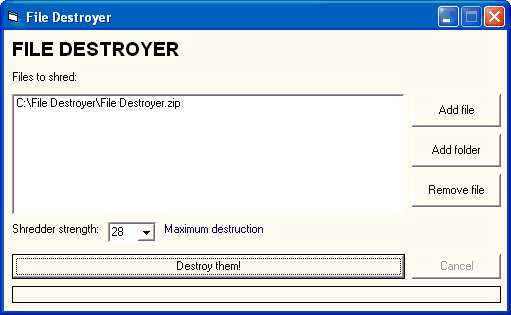



## File Destroyer \- a secure file deletion utility

### Description

A fast and straightforward file shredding/wiping utility. When normal files are deleting from the recycle bin or deleted using the Kill statement, the operating system simply marks the file as deleted and ignores it. Files can be easily recovered using file recovery software. Confidential information should be completely destroyed and sanitised using specialised software.

File Destroyer is a simple utility which overwrites your data up to 28 times with alternating bitstreams of 0s and 1s (null bytes and Chr(255) bytes). It then overwrites the file many times with random binary data. Finally, the file is renamed several times at random to remove all traces of the filename and then deleted using the standard Kill statement.

Files wiped using File Destroyer will be extremely difficult to recover, if they can be recovered at all. It combines the standard DoD as well as ShredFile techniques with file renaming to ensure your data cannot be recovered. It uses byte arrays instead of string appends to ensure an extremely high speed at generating random strings, and uses the cryptographic quality RC4 pseudorandom number generator instead of the standard Rnd function to generate random binary data of a much higher quality.

Simply add files or folders to be deleted to a list, select the number of passes (28 is maximum) and then press the Destroy button.

It is tiny in file size - compiled EXE is 36KB while zipped source is 2KB!
 
### More Info
 

             |
---                |---
**Submitted On**   |2003-09-16 19:08:00
**By**             |[TechnoSoft21](https://github.com/Planet-Source-Code/PSCIndex/blob/master/ByAuthor/technosoft21.md)
**Level**          |Intermediate
**User Rating**    |5.0 (15 globes from 3 users)
**Compatibility**  |VB 6\.0
**Category**       |[Complete Applications](https://github.com/Planet-Source-Code/PSCIndex/blob/master/ByCategory/complete-applications__1-27.md)
**World**          |[Visual Basic](https://github.com/Planet-Source-Code/PSCIndex/blob/master/ByWorld/visual-basic.md)
**Archive File**   |[File\_Destr1646429172003\.zip](https://github.com/Planet-Source-Code/technosoft21-file-destroyer-a-secure-file-deletion-utility__1-48577/archive/master.zip)

